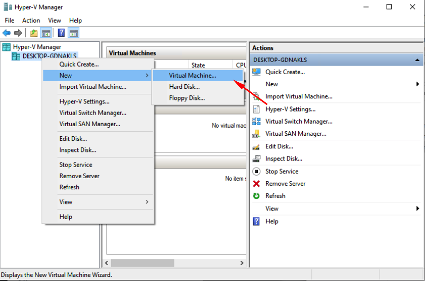
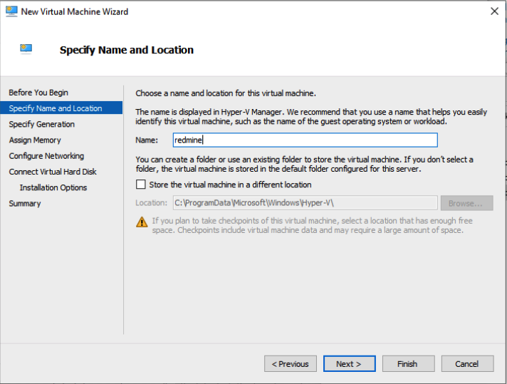
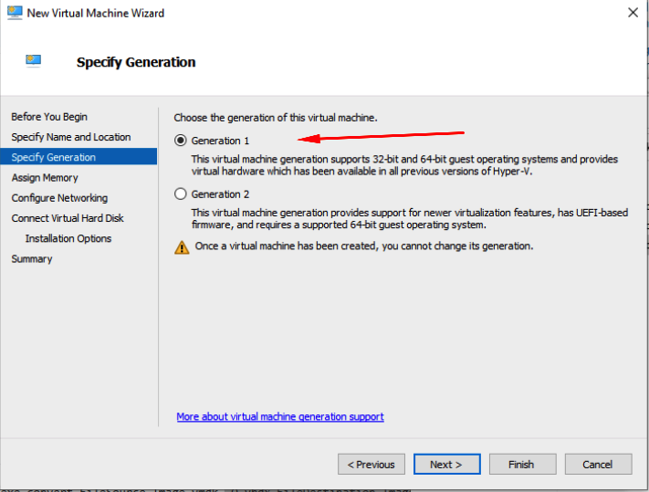
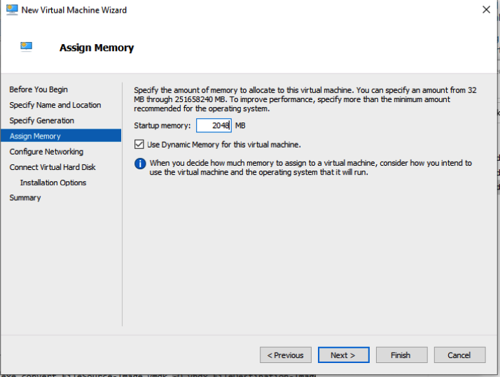
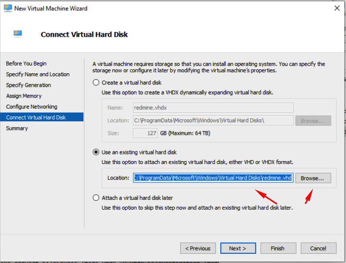

# Как импортировать .OVA файл образа в Hyper-V

## нам нужно:

- сам OVA образ
- архиватор 7zip
- virtualbox (нужен его VBoxManage.exe который лежит обычно тут - C:\Program Files\Oracle\VirtualBox\VBoxManage.exe)

## наши действия:

- распаковка .ova чтоб вытащить .vmdk
- onvert .vmdk hard-drive to a .vhd
- конвертируем .vmdk в .vhd командой:

 ```no-line-numbers
VBoxManage.exe clonehd "D:\МестоГдеЛежитФайл\redmine-disk001.vmdk" redmine.vhd --format vhd
 ```

- кладем получившийся redmine.vhd в папку с дисками Hyper-V (обычно тут - "C:\ProgramData\Microsoft\Windows\Virtual Hard Disks")
- создаём новую виртуальную машину


<center>создаём</center><br>

<center>называем</center><br>

<center>выбираем поколение 1</center><br>

<center>выделяем оперативку</center><br>

<center>указываем наш диск .vhd</center><br>


Должно работать. Это решение мне было нужно, что бы на одной физической машине запустить Докер и Виртуал бокс, но в итоге использовал Hyper-V вместо этого